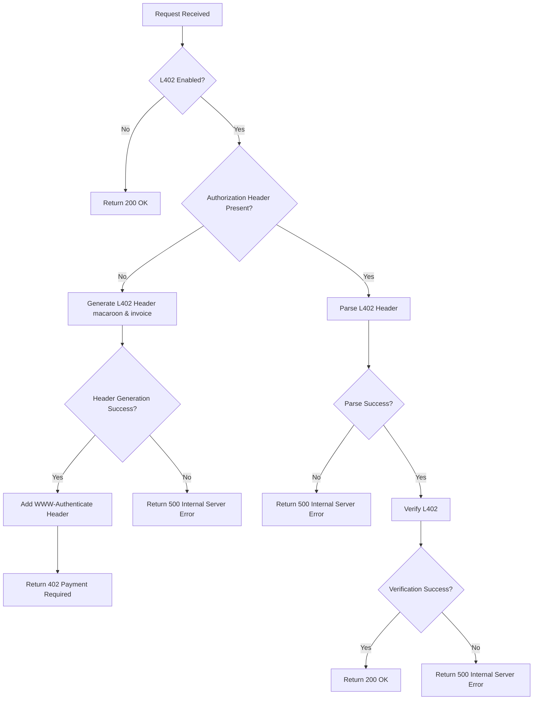

# L402 Nginx Module

<<<<<<< Updated upstream
An [L402](https://docs.lightning.engineering/the-lightning-network/l402) authentication module/plugin for Nginx that integrates seamlessly into your web server, enabling Lightning Network-based monetization for your REST APIs (HTTP/1 and HTTP/2). It supports Lightning Network Daemon (LND), LNURL, and Nostr Wallet Connect (NWC) for invoice generation. The module can be configured to charge per unique API call, allowing you to monetize your endpoints based on specific request paths.
=======
An [L402](https://docs.lightning.engineering/the-lightning-network/l402) authentication module/plugin for Nginx that integrates seamlessly into your web server, enabling Lightning Network-based monetization for your REST APIs (HTTP/1 and HTTP/2). It supports Lightning Network Daemon (LND), Lightning Network URL (LNURL), and Nostr Wallet Connect (NWC) for invoice generation. The module can be configured to charge per unique API call, allowing you to monetize your endpoints based on specific request paths.
>>>>>>> Stashed changes



## Installation & Usage

1. Download the module file `libngx_l402_lib.so` from the [latest release](https://github.com/DhananjayPurohit/ngx_l402/releases/latest) and copy it to your Nginx modules directory (typically `/etc/nginx/modules/`)

2. Enable the module in your nginx.conf:

```nginx
load_module /etc/nginx/modules/libngx_l402_lib.so;
``` 

3. Enable L402 for specific locations:

```nginx
location /protected {
    root   /usr/share/nginx/html;
    index  index.html index.htm;
    
    # l402 module directive:   
    l402 on;
}
```

4. Set the following environment variables:

if using LNURL:
```bash
export LN_CLIENT_TYPE=LNURL
export LNURL_ADDRESS=
# Root key for minting macaroons
export ROOT_KEY=
export CURRENCY=USD
export AMOUNT=0.01
```

if using LND:
```bash
export LN_CLIENT_TYPE=LND
export LND_ADDRESS=
export MACAROON_FILE_PATH=
export CERT_FILE_PATH=
# Root key for minting macaroons
export ROOT_KEY=
export CURRENCY=USD
export AMOUNT=0.01
```

if using NWC:
```bash
export LN_CLIENT_TYPE=NWC
export NWC_URI=
# Root key for minting macaroons
export ROOT_KEY=
export CURRENCY=USD
export AMOUNT=0.01
```

5. Restart Nginx:
```bash
sudo systemctl restart nginx
```

## Building from Source

To build the module from source:

1. Install Rust and Cargo if not already installed:

```bash
<<<<<<< Updated upstream
=======
curl --proto '=https' --tlsv1.2 -sSf https://sh.rustup.rs | sh
```
>>>>>>> Stashed changes

2. Clone the repository:

```bash
git clone https://github.com/DhananjayPurohit/ngx_l402.git
cd ngx_l402
```

3. Build the module:

```bash
cargo build --release --features export-modules
```

The compiled module will be created at `/target/release/libngx_l402_lib.so`.
