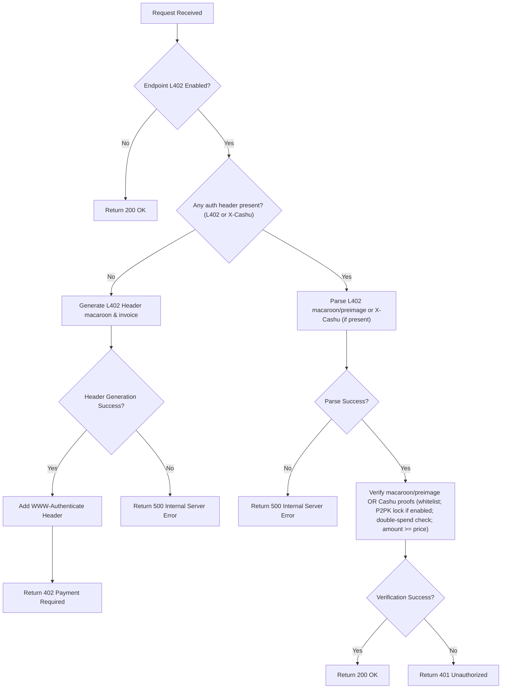

# L402 Nginx Module

An [L402](https://docs.lightning.engineering/the-lightning-network/l402) authentication module/plugin for Nginx that integrates seamlessly into your web server, enabling Lightning Network-based monetization for your REST APIs (HTTP/1 and HTTP/2). It supports Lightning Network Daemon (LND), Core Lightning (CLN), Lightning Network URL (LNURL), Nostr Wallet Connect (NWC), and BOLT12 Lightning Offers for invoice generation. The module can be configured to charge per unique API call, allowing you to monetize your endpoints based on specific request paths.




## Installation & Usage

> **Note**: This module requires **NGINX version 1.28.0** or later. Earlier versions will cause module version mismatch errors.

### Option 1: Manual Installation

1. Download the module file `libngx_l402_lib.so` from the [latest release](https://github.com/DhananjayPurohit/ngx_l402/releases/latest) and copy it to your Nginx modules directory (typically `/etc/nginx/modules/`)

2. Enable the module in your nginx.conf:

```nginx
load_module /etc/nginx/modules/libngx_l402_lib.so;
``` 

3. Enable L402 for specific locations:

```nginx
location /protected {
    root   /usr/share/nginx/html;
    index  index.html index.htm;
    
    # l402 module directive:   
    l402 on;
    l402_amount_msat_default    10000;
    # Note: Dynamic pricing is handled via Redis using the request path as key
    # Example: SET /protected 15000 (sets price to 15000 msats for /protected endpoint)
    l402_macaroon_timeout 3600;  # Macaroon validity in seconds, set to 0 to disable timeout
}
```

4. Set the following environment variables in `nginx.service` (typically in `/lib/systemd/system/nginx.service`):

```
[Service]
...
# Use one of the following:
# if using LNURL:
Environment=LN_CLIENT_TYPE=LNURL
Environment=LNURL_ADDRESS=username@your-lnurl-server.com
Environment=ROOT_KEY=your-root-key
# if using LND:
Environment=LN_CLIENT_TYPE=LND
Environment=LND_ADDRESS=your-lnd-ip.com
Environment=MACAROON_FILE_PATH=/path/to/macaroon
Environment=CERT_FILE_PATH=/path/to/cert
Environment=ROOT_KEY=your-root-key
# if using CLN:
Environment=LN_CLIENT_TYPE=CLN
Environment=CLN_LIGHTNING_RPC_FILE_PATH=/path/to/lightning-rpc
Environment=ROOT_KEY=your-root-key
# if using NWC (supports NIP47 NWC URIs only):
Environment=LN_CLIENT_TYPE=NWC
Environment=NWC_URI=nostr+walletconnect://<pubkey>?relay=<relay_url>&secret=<secret>
Environment=ROOT_KEY=your-root-key
# if using BOLT12 (Reusable Offers):
Environment=LN_CLIENT_TYPE=BOLT12
Environment=BOLT12_OFFER=lno1...
Environment=CLN_LIGHTNING_RPC_FILE_PATH=/path/to/lightning-rpc
Environment=ROOT_KEY=your-root-key

# To use redis to set price dynamically
Environment=REDIS_URL=redis://127.0.0.1:6379

# To accept Cashu tokens as Ecash for L402:
Environment=CASHU_ECASH_SUPPORT=true
Environment=CASHU_DB_PATH=/var/lib/nginx/cashu_tokens.db
Environment=CASHU_WALLET_SECRET=<your-secret-random-string>
# IMPORTANT: Change CASHU_WALLET_SECRET to a unique random string!
# Generate one with: openssl rand -hex 32
# Optional: Whitelist specific Cashu mints (comma-separated URLs)
Environment=CASHU_WHITELISTED_MINTS=https://mint1.example.com,https://mint2.example.com

# Optional: Enable automatic redemption of Cashu tokens to Lightning (default: false)
Environment=CASHU_REDEEM_ON_LIGHTNING=true
# Optional: Set interval for automatic redemption (defaults to 3600 seconds/1 hour)
Environment=CASHU_REDEMPTION_INTERVAL_SECS=<seconds>
# Optional: Configure melt/redemption fee handling (percentage-based with minimum fallback)
# Minimum balance to attempt melting (default: 10 sats)
Environment=CASHU_MELT_MIN_BALANCE_SATS=10
# Percentage to reserve for fees (default: 1%)
Environment=CASHU_MELT_FEE_RESERVE_PERCENT=1
# Minimum fee reserve when percentage is small (default: 4 sats)
Environment=CASHU_MELT_MIN_FEE_RESERVE_SATS=4
# Maximum number of proofs to melt per operation (default: 0 = unlimited)
# Example: 2000 proofs > 1000 limit → melt first 1000 proofs, rest remain for next cycle
Environment=CASHU_MAX_PROOFS_PER_MELT=1000

# Optional: Enable P2PK mode for optimized verification (NUT-11 + NUT-24)
# PERFORMANCE OPTIMIZATION - Requires P2PK-locked tokens from clients
# When enabled, the proxy will:
# - Derive public key from private key and send it in X-Cashu header (NUT-24)
# - Require clients to create P2PK-locked tokens to that public key
# - Verify tokens are locked to our public key (NUT-11)
# - Unlock proofs using private key (local operation - instant!)
# - Store unlocked proofs in CDK database (no mint swap call!)
# - Track accepted tokens in memory cache for double-spend protection
# - Regular redemption task redeems via wallet.melt() (same flow as standard mode)
# NOTE: When P2PK mode is enabled, CASHU_WHITELISTED_MINTS is REQUIRED
Environment=CASHU_P2PK_MODE=true
Environment=CASHU_P2PK_PRIVATE_KEY=<your-private-key-hex>
# Generate a private key with: openssl rand -hex 32
# Public key is derived automatically from this private key

# For logging
Environment=RUST_LOG=info  # For more detailed logs, configure debug
# OR for module-specific debug logs only:
Environment=RUST_LOG=ngx_l402_lib=debug,info
...
```
> **Note**: Cashu eCash support has two modes:
> - **Standard mode** (default): Accepts any Cashu tokens by synchronously calling `wallet.receive()` which contacts the mint to swap tokens during the request. Secure but slower per-request due to blocking mint API calls.
> - **P2PK mode** (optional): **P2PK-locked token mode** (NUT-11) that requires tokens to be locked to the proxy's public key. The proxy:
>   1. Derives a public key from `CASHU_P2PK_PRIVATE_KEY` and sends it in the X-Cashu header (NUT-24)
>   2. Clients must create P2PK-locked tokens to this public key
>   3. Proxy verifies tokens are locked to its public key and unlocks them with the private key
>   4. Stores unlocked proofs directly in CDK database using cached keysets (no mint swap call!)
>   5. Regular redemption task finds and redeems them via `wallet.melt()`
>   
>   Much faster per-request (milliseconds), ideal for high-traffic scenarios. Proofs stored in same CDK tables.

> **⚠️ SECURITY**: The `CASHU_WALLET_SECRET` environment variable is **CRITICAL** for security. This secret is used to generate the wallet seed. Anyone with access to this secret can steal your tokens! 
> - **Generate a strong random secret**: `openssl rand -hex 32`
> - **Never commit this to Git**
> - **Keep it in a secure environment variable or secrets manager**
> - **Different for each deployment/environment**
>
> **⚠️ SECURITY**: The `CASHU_P2PK_PRIVATE_KEY` is **EQUALLY CRITICAL** when P2PK mode is enabled. This key is used to unlock P2PK-locked tokens. Anyone with access to this key can spend tokens locked to your public key!
> - **Generate securely**: `openssl rand -hex 32`
> - **Never commit to Git or share publicly**
> - **Keep it secure alongside CASHU_WALLET_SECRET**

> **Note**: The `CASHU_WHITELISTED_MINTS` environment variable allows you to restrict which Cashu mints are accepted. If not configured, all mints will be accepted in standard mode. **In P2PK mode, whitelisted mints are REQUIRED** for security and the payment request (NUT-24).

> **Note on Fee Configuration**: The melt/redemption fee handling uses a **percentage-based approach with a minimum fallback** and **optional proof count limiting**:
> - `CASHU_MELT_MIN_BALANCE_SATS`: Minimum balance (in sats) required before attempting to melt tokens to Lightning. Balances below this are skipped to avoid wasting fees on tiny amounts. Default: 10 sats.
> - `CASHU_MELT_FEE_RESERVE_PERCENT`: Percentage of total balance to reserve for melt fees. The system calculates `fee_reserve = total_amount × (percent / 100)`. Default: 1%.
> - `CASHU_MELT_MIN_FEE_RESERVE_SATS`: Minimum fee reserve (in sats) used when the percentage calculation results in a very small amount. Final reserve = `max(percentage_fee, minimum_fee)`. Default: 4 sats.
> - `CASHU_MAX_PROOFS_PER_MELT`: Maximum number of proofs to melt in a single operation. **Logic**: `if (proof_count > limit) then select_first(limit_proofs)`. Calculates total value of selected proofs and generates invoice for that amount. Remaining proofs stay for the next redemption cycle. Set to 0 to disable (default). **Use case**: Prevent hitting mint proof limits per melt operation (e.g., mint.coinos.io has 1000 proof limit).
>
> **Example 1** - Large balance (500 sats) with 1% fee reserve:
> - Percentage fee: `500 × 1% = 5 sats`
> - Minimum fee: `4 sats`
> - Used reserve: `max(5, 4) = 5 sats`
> - Redeemable: `500 - 5 = 495 sats` to Lightning invoice
>
> **Example 2** - Small balance (50 sats) with 1% fee reserve:
> - Percentage fee: `50 × 1% = 0.5 sats`
> - Minimum fee: `4 sats`
> - Used reserve: `max(0.5, 4) = 4 sats` ← Minimum kicks in!
> - Redeemable: `50 - 4 = 46 sats` to Lightning invoice
>
> **Example 3** - Proof count limiting when exceeds mint limit:
> - **Scenario**: Have `1282 proofs` worth 13,588 sats total
> - **Setting**: `CASHU_MAX_PROOFS_PER_MELT=1000`
> - **Check**: `1282 proofs > 1000 limit` → ✅ **Limiting triggered**
> - **Action**: Select first `1000 proofs` worth ~10,600 sats
> - **Invoice**: Generate invoice for `10,600 sats` (value of selected 1000 proofs)
> - **Melt**: Send only those 1000 proofs to mint
> - **Remaining**: `282 proofs` (~2,988 sats) stay for next cycle
> - **Next cycle**: `282 proofs < 1000 limit` → melts all remaining proofs
>
> Actual melt quote fees are verified against the reserve; warnings appear if the reserve was insufficient.

> **Performance Note**: P2PK mode **eliminates the mint swap call** during request processing. The proxy derives a public key and sends it to clients via the X-Cashu header. Clients create P2PK-locked tokens to that public key. When the proxy receives a token:
>   1. Validates it locally (structure, amount, whitelist)
>   2. Verifies proofs are locked to its public key (NUT-11)
>   3. Uses cached keysets to extract proofs (one-time fetch per mint, then cached)
>   4. Unlocks proofs with private key (local cryptographic operation)
>   5. Stores unlocked proofs directly in CDK database via `wallet.receive_proofs()`
>
>   No mint swap API call! The automatic redemption task finds these proofs via `wallet.get_unspent_proofs()` and redeems them to Lightning via `wallet.melt()`. This dramatically reduces response time (from seconds to milliseconds), prevents mint overload, and enables much higher request rates.

> **Note**: The module supports dynamic pricing through Redis, allowing you to change endpoint prices in real-time without restarting Nginx. When Redis is configured, the module will check Redis for a price override before using the default price specified in the nginx configuration.

### Dynamic Configuration via Redis

The module supports real-time configuration updates via Redis without requiring an Nginx reload. This is useful for dynamic pricing and multi-tenant routing.

#### 1. Dynamic Pricing
Set the price for a specific path in Redis:
```bash
# Set price to 1000 msats for /api/resource
SET /api/resource 1000
```

#### 2. Dynamic LNURL (Multi-Tenant)
Override the LNURL address for a specific path dynamically. This takes precedence over the `l402_lnurl_addr` in nginx.conf.

**Key Format**: `lnurl:<request_path>`

```bash
# Route payments for /api/tenant1 to a specific LNURL
SET lnurl:/api/tenant1 alice@getalby.com

# Route payments for /api/tenant2 to another LNURL
SET lnurl:/api/tenant2 bob@getalby.com
```

> **Updates are Immediate**: Changes made in Redis are picked up immediately by the next request. No Nginx reload is required.

### Multi-Tenant Configuration

The module supports **multi-tenant mode**, allowing different API routes to use different Lightning/LNURL backends. This is useful for platforms hosting multiple merchants or services, where each tenant receives payments to their own wallet.

> **Current Support**: Multi-tenant is currently supported for **Cashu eCash payments only** when using `LN_CLIENT_TYPE=LNURL`. Each tenant's Cashu tokens are tracked separately and redeemed to their respective LNURL addresses.

#### How It Works

1. **Per-location LNURL addresses**: Use the `l402_lnurl_addr` directive to specify different LNURL addresses for each location
2. **Proof tracking**: When a Cashu token is received, the proofs are mapped to the tenant's LNURL address in Redis
3. **Grouped redemption**: The automatic redemption task groups proofs by tenant and redeems each group to the correct LNURL address

#### Nginx Configuration Example

```nginx
# Tenant 1 - payments go to alice@getalby.com
location /api/tenant1 {
    l402 on;
    l402_amount_msat_default 10000;
    l402_macaroon_timeout 0;
    l402_lnurl_addr "alice@getalby.com";
}

# Tenant 2 - payments go to bob@getalby.com
location /api/tenant2 {
    l402 on;
    l402_amount_msat_default 15000;
    l402_macaroon_timeout 0;
    l402_lnurl_addr "bob@getalby.com";
}

# Tenant 3 - payments go to a self-hosted LNURL server
location /api/tenant3 {
    l402 on;
    l402_amount_msat_default 5000;
    l402_macaroon_timeout 0;
    l402_lnurl_addr "user@your-lnurl-server.com";
}
```

#### Environment Variables for Multi-Tenant

```bash
# Required: Use LNURL client type for multi-tenant support
Environment=LN_CLIENT_TYPE=LNURL

# Default LNURL address (used when l402_lnurl_addr is not specified)
Environment=LNURL_ADDRESS=default@your-domain.com

# Required: Redis for proof-to-tenant mapping
Environment=REDIS_URL=redis://127.0.0.1:6379

# Required: Enable Cashu eCash support
Environment=CASHU_ECASH_SUPPORT=true
Environment=CASHU_WALLET_SECRET=<your-secret>
Environment=CASHU_WHITELISTED_MINTS=https://mint.example.com

# Enable automatic redemption to Lightning
Environment=CASHU_REDEEM_ON_LIGHTNING=true
Environment=CASHU_REDEMPTION_INTERVAL_SECS=60
```

> **Note**: Right now, the module only supports multi-tenant for lnurl with cashu only

5. Set up SQLite database directory (if accepting Cashu tokens):
```bash
# One-time setup: Create directory for SQLite database
# These commands only need to be run once and persist across restarts
sudo mkdir -p /var/lib/nginx
sudo chown nginx:nginx /var/lib/nginx

# Set proper permissions
sudo chmod 755 /var/lib/nginx
```

6. Restart and reload Nginx:
```bash
sudo systemctl restart nginx
sudo systemctl reload nginx
```

**Note:** The directory setup above is **one-time only** and persists across nginx restarts. You only need to run these commands once after installation.

**Important:** Both `restart` and `reload` are needed to ensure the Cashu redemption task starts properly and you can see redemption logs.

The cdk-sqlite crate will automatically create the database file and tables when the module initializes. SQLite uses WAL mode for better concurrency. Database location: `/var/lib/nginx/cashu_tokens.db`

### Option 2: Using Docker Images

The easiest way to deploy the L402 Nginx module is by using our official Docker images:

```bash
# Pull the image
docker pull ghcr.io/dhananjaypurohit/ngx_l402:latest
```

#### Quick Start Examples

**1. LNURL Backend (Simple Setup)**
```bash
docker run -d \
  --name l402-nginx \
  -p 8000:8000 \
  -e LN_CLIENT_TYPE=LNURL \
  -e LNURL_ADDRESS=username@your-lnurl-server.com \
  -e ROOT_KEY=your-32-byte-hex-key \
  ghcr.io/dhananjaypurohit/ngx_l402:latest
```

**2. LND Backend with Cashu Support**
```bash
# Create data directory for credentials
mkdir -p ~/l402-data

# Copy your LND credentials
cp ~/.lnd/data/chain/bitcoin/mainnet/admin.macaroon ~/l402-data/
cp ~/.lnd/tls.cert ~/l402-data/

docker run -d \
  --name l402-nginx \
  -p 8000:8000 \
  -e LN_CLIENT_TYPE=LND \
  -e LND_ADDRESS=your-lnd-ip:10009 \
  -e MACAROON_FILE_PATH=/app/data/admin.macaroon \
  -e CERT_FILE_PATH=/app/data/tls.cert \
  -e CASHU_ECASH_SUPPORT=true \
  -e CASHU_WALLET_SECRET=your-32-byte-hex-secret \
  -e CASHU_DB_PATH=/app/data/cashu_tokens.db \
  -e CASHU_WHITELISTED_MINTS=https://mint1.example.com,https://mint2.example.com \
  -e CASHU_REDEEM_ON_LIGHTNING=true \
  -e REDIS_URL=redis://redis:6379 \
  -v ~/l402-data:/app/data \
  ghcr.io/dhananjaypurohit/ngx_l402:latest
```

**3. CLN Backend (Core Lightning)**
```bash
docker run -d \
  --name l402-nginx \
  -p 8000:8000 \
  -e LN_CLIENT_TYPE=CLN \
  -e CLN_LIGHTNING_RPC_FILE_PATH=/app/data/lightning-rpc \
  -e ROOT_KEY=your-32-byte-hex-key \
  -e CASHU_ECASH_SUPPORT=true \
  -e CASHU_WALLET_SECRET=your-32-byte-hex-secret \
  -e CASHU_DB_PATH=/app/data/cashu_tokens.db \
  -v ~/.lightning/bitcoin/lightning-rpc:/app/data/lightning-rpc:ro \
  ghcr.io/dhananjaypurohit/ngx_l402:latest
```

**4. NWC Backend (Nostr Wallet Connect)**
```bash
docker run -d \
  --name l402-nginx \
  -p 8000:8000 \
  -e LN_CLIENT_TYPE=NWC \
  -e NWC_URI=nostr+walletconnect://your-pubkey?relay=wss://relay.damus.io&secret=your-secret \
  -e ROOT_KEY=your-32-byte-hex-key \
  ghcr.io/dhananjaypurohit/ngx_l402:latest
```

**5. High-Performance P2PK Mode (Recommended for Production)**
```bash
docker run -d \
  --name l402-nginx \
  -p 8000:8000 \
  -e LN_CLIENT_TYPE=LND \
  -e LND_ADDRESS=your-lnd-ip:10009 \
  -e MACAROON_FILE_PATH=/app/data/admin.macaroon \
  -e CERT_FILE_PATH=/app/data/tls.cert \
  -e CASHU_ECASH_SUPPORT=true \
  -e CASHU_P2PK_MODE=true \
  -e CASHU_P2PK_PRIVATE_KEY=your-32-byte-hex-private-key \
  -e CASHU_WALLET_SECRET=your-32-byte-hex-secret \
  -e CASHU_DB_PATH=/app/data/cashu_tokens.db \
  -e CASHU_WHITELISTED_MINTS=https://mint1.example.com \
  -e CASHU_REDEEM_ON_LIGHTNING=true \
  -e REDIS_URL=redis://redis:6379 \
  -v ~/l402-data:/app/data \
  ghcr.io/dhananjaypurohit/ngx_l402:latest
```

**6. BOLT12 Backend (Reusable Offers)**
```bash
docker run -d \
  --name l402-nginx \
  -p 8000:8000 \
  -e LN_CLIENT_TYPE=BOLT12 \
  -e BOLT12_OFFER=lno1... \
  -e CLN_LIGHTNING_RPC_FILE_PATH=/app/data/lightning-rpc \
  -e ROOT_KEY=your-32-byte-hex-key \
  -v ~/.lightning/bitcoin/lightning-rpc:/app/data/lightning-rpc:ro \
  ghcr.io/dhananjaypurohit/ngx_l402:latest
```

#### Required Secrets Generation

Before running, generate the required secrets:

```bash
# Generate ROOT_KEY (required for all setups)
openssl rand -hex 32

# Generate CASHU_WALLET_SECRET (for Cashu support)
openssl rand -hex 32

# Generate CASHU_P2PK_PRIVATE_KEY (for P2PK mode)
openssl rand -hex 32
```

#### Testing Your Setup

```bash
# Test free endpoint
curl http://localhost:8000/

# Test protected endpoint (should return 402 with L402 header)
curl -i http://localhost:8000/protected

# Check container logs
docker logs l402-nginx -f

# Stop the container
docker stop l402-nginx
```

For specific versions:
```bash
docker pull ghcr.io/dhananjaypurohit/ngx_l402:v1.1.2
```

## ⚡ L402 Protocol Notes

This module implements the [L402 protocol](https://docs.lightning.engineering/the-lightning-network/l402) using standard Lightning Network payments. The implementation:

- **Preimage Requirement**: Only supports standard 32-byte (256-bit) Lightning preimages, as specified by the Lightning Network protocol. The preimage is verified against the payment_hash using SHA256 hashing.
- **Payment Verification**: When a client provides an L402 authorization header with a preimage, it must be exactly 32 bytes to match the Lightning Network standard.
- **Wallet Compatibility**: ⚠️ Note that some wallets like [Wallet of Satoshi](https://www.walletofsatoshi.com/) provide 48-byte preimages (non-standard), which are **not compatible** with this module. For payment use wallets that provide standard 32-byte Lightning preimages.

## 📋 Logging

### View Logs
```bash
# Module initialization and system logs
sudo journalctl -u nginx

# Nginx error logs
sudo tail -f /var/log/nginx/error.log

# Cashu redemption logs
sudo tail -f /var/log/nginx/cashu_redemption.log

# Docker logs
docker logs container-name -f
```

## Building from Source

To build the module from source:

1. Install required dependencies:

```bash
sudo apt-get install -y build-essential clang libclang-dev libc6-dev zlib1g-dev pkg-config libssl-dev protobuf-compiler nginx
```

2. Install Rust and Cargo if not already installed:

```bash
curl --proto '=https' --tlsv1.2 -sSf https://sh.rustup.rs | sh
```

3. Clone the repository:

```bash
git clone https://github.com/DhananjayPurohit/ngx_l402.git
cd ngx_l402
```

4. Build the module:

```bash
cargo build --release --features export-modules
```

The compiled module will be created at `/target/release/libngx_l402_lib.so`.
