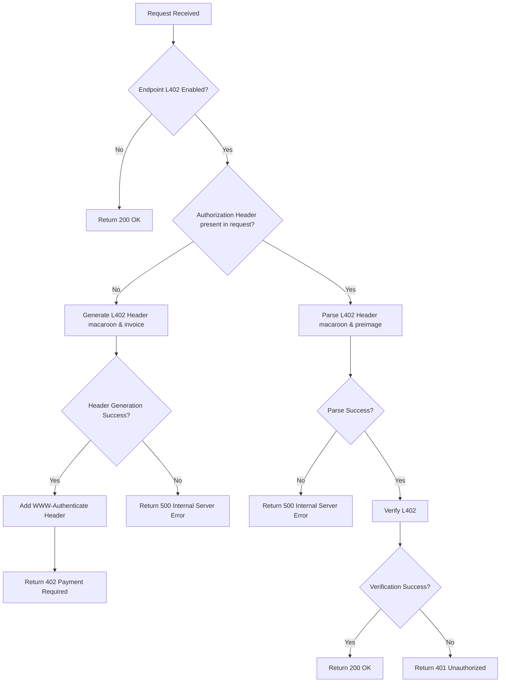

# L402 Nginx Module

An [L402](https://docs.lightning.engineering/the-lightning-network/l402) authentication module/plugin for Nginx that integrates seamlessly into your web server, enabling Lightning Network-based monetization for your REST APIs (HTTP/1 and HTTP/2). It supports Lightning Network Daemon (LND), Core Lightning (CLN), Lightning Network URL (LNURL), and Nostr Wallet Connect (NWC) for invoice generation. The module can be configured to charge per unique API call, allowing you to monetize your endpoints based on specific request paths.




## Installation & Usage

> **Note**: This module requires **NGINX version 1.28.0** or later. Earlier versions will cause module version mismatch errors.

1. Download the module file `libngx_l402_lib.so` from the [latest release](https://github.com/DhananjayPurohit/ngx_l402/releases/latest) and copy it to your Nginx modules directory (typically `/etc/nginx/modules/`)

2. Enable the module in your nginx.conf:

```nginx
load_module /etc/nginx/modules/libngx_l402_lib.so;
``` 

3. Enable L402 for specific locations:

```nginx
location /protected {
    root   /usr/share/nginx/html;
    index  index.html index.htm;
    
    # l402 module directive:   
    l402 on;
    l402_amount_msat_default    10000;
    # Note: Dynamic pricing is handled via Redis using the request path as key
    # Example: SET /protected 15000 (sets price to 15000 msats for /protected endpoint)
    l402_macaroon_timeout 3600;  # Macaroon validity in seconds, set to 0 to disable timeout
}
```

4. Set the following environment variables in `nginx.service` (typically in `/lib/systemd/system/nginx.service`):

```
[Service]
...
# Use one of the following:
# if using LNURL:
Environment=LN_CLIENT_TYPE=LNURL
Environment=LNURL_ADDRESS=https://your-lnurl-server.com
Environment=ROOT_KEY=your-root-key
# if using LND:
Environment=LN_CLIENT_TYPE=LND
Environment=LND_ADDRESS=https://your-lnd-server.com
Environment=MACAROON_FILE_PATH=/path/to/macaroon
Environment=CERT_FILE_PATH=/path/to/cert
Environment=ROOT_KEY=your-root-key
# if using CLN:
Environment=LN_CLIENT_TYPE=CLN
Environment=CLN_LIGHTNING_RPC_FILE_PATH=/path/to/lightning-rpc
Environment=ROOT_KEY=your-root-key
# if using NWC (supports NIP47 NWC URIs only):
Environment=LN_CLIENT_TYPE=NWC
Environment=NWC_URI=nostr+walletconnect://<pubkey>?relay=<relay_url>&secret=<secret>
Environment=ROOT_KEY=your-root-key

# To use redis to set price dynamically
Environment=REDIS_URL=redis://127.0.0.1:6379

# To accept Cashu tokens as Ecash for L402:
Environment=CASHU_ECASH_SUPPORT=true
Environment=CASHU_DB_PATH=/var/lib/nginx/cashu_tokens.db
Environment=CASHU_WALLET_SECRET=<your-secret-random-string>
# IMPORTANT: Change CASHU_WALLET_SECRET to a unique random string!
# Generate one with: openssl rand -hex 32
# Optional: Enable automatic redemption of Cashu tokens to Lightning (default: false)
Environment=CASHU_REDEEM_ON_LIGHTNING=true
# Optional: Set interval for automatic redemption (defaults to 3600 seconds/1 hour)
Environment=CASHU_REDEMPTION_INTERVAL_SECS=<seconds>
# Optional: Whitelist specific Cashu mints (comma-separated URLs)
Environment=CASHU_WHITELISTED_MINTS=https://mint1.example.com,https://mint2.example.com

# For logging
Environment=RUST_LOG=info  # For more detailed logs, configure debug
# OR for module-specific debug logs only:
Environment=RUST_LOG=ngx_l402_lib=debug,info
...
```
> **Note**: Cashu eCash support is currently in testing phase. While it allows accepting Cashu tokens as payment for L402 challenges, it does not currently implement local double-spend protection. Use this feature with caution in production environments.

> **⚠️ SECURITY**: The `CASHU_WALLET_SECRET` environment variable is **CRITICAL** for security. This secret is used to generate the wallet seed. Anyone with access to this secret can steal your tokens! 
> - **Generate a strong random secret**: `openssl rand -hex 32`
> - **Never commit this to Git**
> - **Keep it in a secure environment variable or secrets manager**
> - **Different for each deployment/environment**

> **Note**: The `CASHU_WHITELISTED_MINTS` environment variable allows you to restrict which Cashu mints are accepted. If not configured, all mints will be accepted. If configured with comma-separated mint URLs, only tokens from those specific mints will be accepted.

> **Note**: The module supports dynamic pricing through Redis, allowing you to change endpoint prices in real-time without restarting Nginx. When Redis is configured, the module will check Redis for a price override before using the default price specified in the nginx configuration.

5. Set up SQLite database directory (if accepting Cashu tokens):
```bash
# One-time setup: Create directory for SQLite database
# These commands only need to be run once and persist across restarts
sudo mkdir -p /var/lib/nginx
sudo chown nginx:nginx /var/lib/nginx

# Set proper permissions
sudo chmod 755 /var/lib/nginx
```

6. Restart and reload Nginx:
```bash
sudo systemctl restart nginx
sudo systemctl reload nginx
```

**Note:** The directory setup above is **one-time only** and persists across nginx restarts. You only need to run these commands once after installation.

**Important:** Both `restart` and `reload` are needed to ensure the Cashu redemption task starts properly and you can see redemption logs.

The cdk-sqlite crate will automatically create the database file and tables when the module initializes. SQLite uses WAL mode for better concurrency. Database location: `/var/lib/nginx/cashu_tokens.db`

## 📋 Logging

### View Logs
```bash
# Module initialization and system logs
sudo journalctl -u nginx

# Nginx error logs
sudo tail -f /var/log/nginx/error.log

# Docker logs
docker logs container-name -f
```

## Building from Source

To build the module from source:

1. Install required dependencies:

```bash
sudo apt-get install -y build-essential clang libclang-dev libc6-dev zlib1g-dev pkg-config libssl-dev nginx
```

2. Install Rust and Cargo if not already installed:

```bash
curl --proto '=https' --tlsv1.2 -sSf https://sh.rustup.rs | sh
```

3. Clone the repository:

```bash
git clone https://github.com/DhananjayPurohit/ngx_l402.git
cd ngx_l402
```

4. Build the module:

```bash
cargo build --release --features export-modules
```

The compiled module will be created at `/target/release/libngx_l402_lib.so`.
