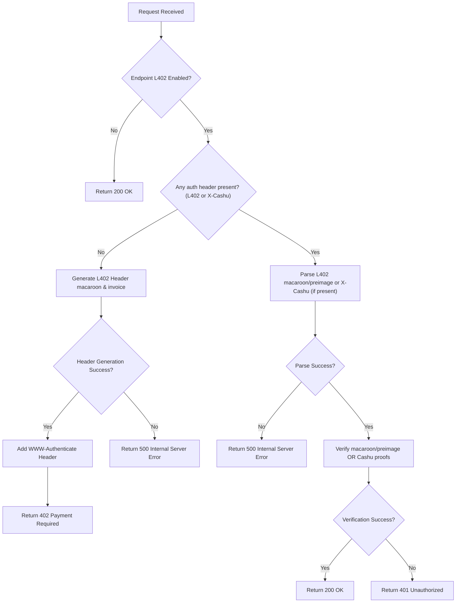

# ngx_l402 — L402 Nginx Module

An [L402](https://docs.lightning.engineering/the-lightning-network/l402) authentication module for Nginx that enables Lightning Network-based monetization for your REST APIs (HTTP/1 and HTTP/2).

It supports the following Lightning backends:

| Backend | Description |
|---|---|
| **LND** | Lightning Network Daemon (direct gRPC) |
| **LNC** | Lightning Node Connect (remote LND via mailbox) |
| **CLN** | Core Lightning |
| **Eclair** | Eclair node |
| **LNURL** | Lightning Network URL |
| **NWC** | Nostr Wallet Connect |
| **BOLT12** | Reusable Lightning Offers |

The module can be configured to charge per unique API call, enabling per-endpoint monetization based on request paths.


---

## How It Works



---

## Quick Start

> **Note**: This module requires **NGINX version 1.28.0** or later.

The fastest way to get started is with Docker:

```bash
docker run -d \
  --name l402-nginx \
  -p 8000:8000 \
  -e LN_CLIENT_TYPE=LNURL \
  -e LNURL_ADDRESS=username@your-lnurl-server.com \
  -e ROOT_KEY=your-32-byte-hex-key \
  ghcr.io/dhananjaypurohit/ngx_l402:latest
```

Then test it:

```bash
# Should return 200 OK
curl http://localhost:8000/

# Should return 402 Payment Required with L402 header
curl -i http://localhost:8000/protected
```

See the [Installation](./installation/manual.md) section for full setup options.
